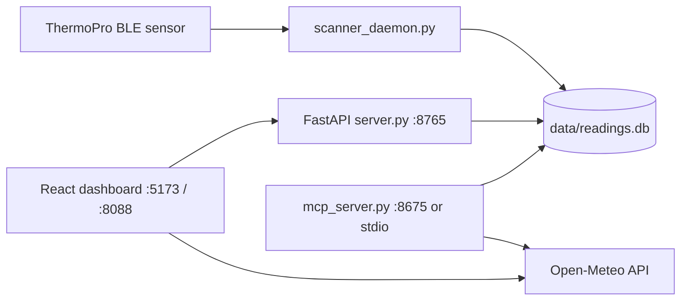

<div align="center">
  
  <h1>Termo Track</h1>
  <p><strong>Live indoor climate tracking from ThermoPro BLE sensors, with outside-weather comparison.</strong><br/>Local-first architecture: scanner, API, and MCP all read the same SQLite data without a cloud account.</p>

  <p>
    
    
    
    
  </p>
</div>

---

## Visual identity

<table>
  <tr>
    <td align="center">
      
      <br/><sub><b>Flat navy thermometer mark (no gradients) for web/PWA assets</b></sub>
    </td>
  </tr>
</table>

---

## What it does

Termo Track listens to ThermoPro BLE broadcasts, stores readings in SQLite, and serves live temperature/humidity to a React dashboard and MCP tools.

- Streams live readings over WebSocket (`/ws`) with stale-data signaling.
- Shows history + min/avg/max stats over selectable windows — recent (6h–7d), or by navigating a specific past month or year.
- Compares indoor readings with outside weather from Open-Meteo (keyless; forecast API for recent windows, historical archive API for month/year).
- Exposes the same sensor data to AI clients via MCP tools.

---

## How it works

```text
1. scanner_daemon.py receives BLE advertisements from ThermoPro sensors
2. scanner writes readings into SQLite (data/readings.db)
3. FastAPI serves REST + WebSocket from the same DB
4. React UI reads /api + /ws through Vite (dev) or nginx (Docker)
5. mcp_server.py exposes sensor and weather tools over stdio or HTTP MCP
```

---

## Architecture



---

## API surface

| Method | Route | Purpose |
|---|---|---|
| GET | `/api/current` | Latest sensor reading |
| GET | `/api/history?hours=24` | Raw readings for a relative time window |
| GET | `/api/history/daily?start&end` | Daily-averaged readings for an absolute `[start, end)` date range (Month/Year views) |
| GET | `/api/stats?hours=24` | Min/max/avg summary for a relative time window |
| GET | `/api/stats/range?start&end` | Min/max/avg summary for an absolute `[start, end)` date range |
| GET | `/api/health` | Service health check |
| WS | `/ws` | Live reading push |

MCP tools (from `backend/mcp_server.py`): `get_current_reading`, `get_sensor_history`, `get_sensor_stats`, `get_comfort_level`, `get_outside_weather`, `get_indoor_outdoor_comparison`.

---

## Tech stack

| Layer | Technology |
|---|---|
| BLE ingestion | Python, `bleak` |
| API | FastAPI, Uvicorn |
| MCP | `mcp` Python SDK (`FastMCP`) |
| Storage | SQLite + `aiosqlite` |
| Frontend | React, TypeScript, Vite, Recharts |
| Container runtime | Docker Compose + nginx |

---

## Repository layout

```text
termo-track/
├── backend/         BLE scanner, FastAPI server, MCP server, DB layer
├── frontend/        React + Vite UI, nginx config, web assets
├── data/            Shared SQLite volume (readings.db)
├── docs/
│   ├── branding/    Generated icon sources for docs/identity
│   └── screenshots/ README visuals
└── docker-compose.yml
```

---

## Run locally

**Prerequisites:** Python 3.11+, Node 18+, a ThermoPro BLE sensor.

```bash
# 1) Backend environment
cd backend
python3 -m venv .venv
.venv/bin/pip install -r requirements.txt

# 2) Frontend dependencies
cd ../frontend
npm install
```

Start services in separate terminals:

```bash
# Terminal A: BLE scanner (host Bluetooth access required)
cd backend
.venv/bin/python scanner_daemon.py

# Terminal B: FastAPI server
cd backend
.venv/bin/python server.py

# Terminal C: frontend dev server
cd frontend
npm run dev
```

Open `http://localhost:5173`.

---

## Run with Docker Compose

The dashboard/API/MCP are containerized. The BLE scanner stays on the host (Docker Desktop on macOS cannot access host BLE directly).

```bash
# Build and start frontend + backend + MCP
docker compose up --build -d

# Run scanner on host against shared DB
cd backend
DB_PATH="$(pwd)/../data/readings.db" .venv/bin/python scanner_daemon.py
```

Ports:
- UI: `http://localhost:8088`
- MCP HTTP endpoint: `http://localhost:8675/mcp`

---

## Build and validation commands

```bash
# Frontend production build
cd frontend && npm run build

# API smoke check
curl -s http://127.0.0.1:8765/api/health

# Single MCP tool check (stdio mode)
cd backend && MCP_TRANSPORT=stdio .venv/bin/python mcp_server.py
```

There is currently no dedicated automated lint/test script in this project.
